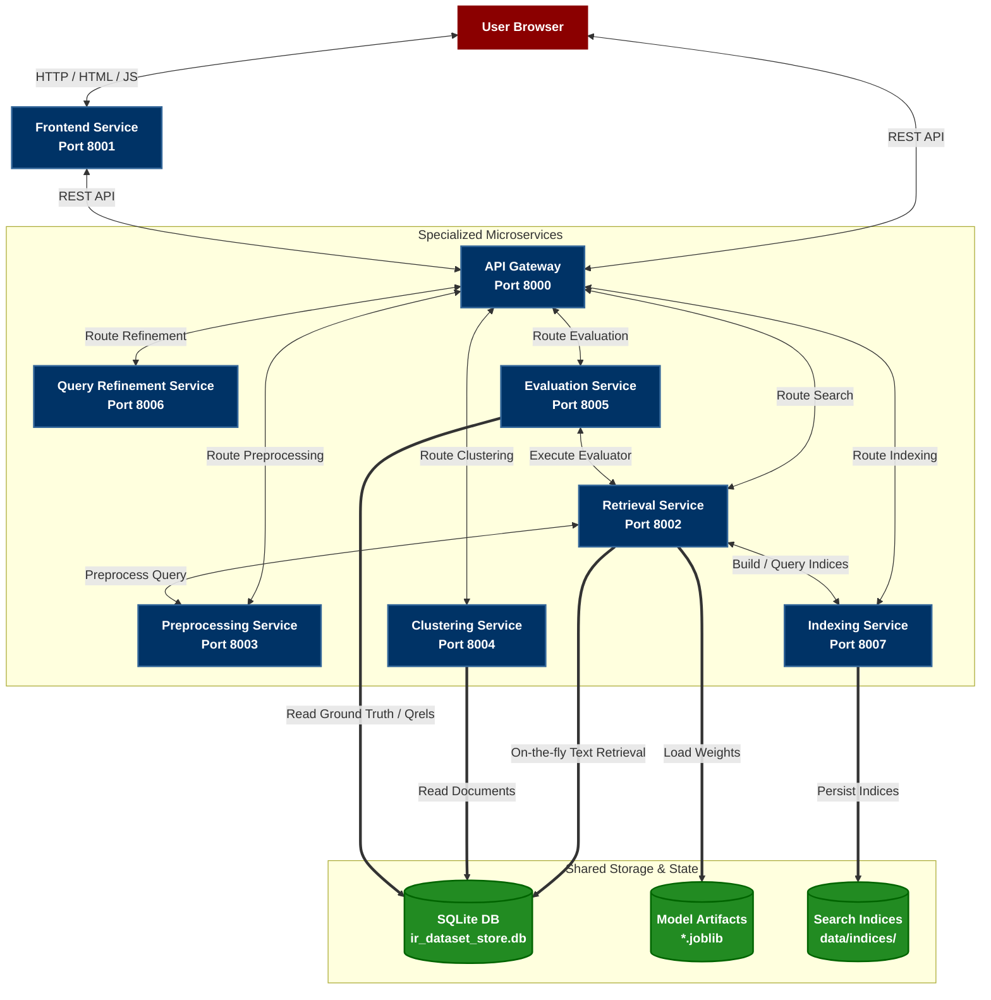

<div align="center">
  
  <h1>🔍 Moli Search Engine</h1>
  <p><strong>A Production-Grade, Multi-Model Information Retrieval System Built on Service-Oriented Architecture (SOA)</strong></p>
  
  <p>
    
    
    
    
    
  </p>
</div>

---

## 📌 Table of Contents

1. [Project Overview](#-project-overview)
2. [Core Capabilities](#-core-capabilities)
3. [System Architecture](#-system-architecture)
4. [Services Breakdown](#-services-breakdown)
5. [Information Retrieval Models](#-information-retrieval-models)
6. [Advanced Features](#-advanced-features)
7. [System Constraints & Rigorous Compliance](#-system-constraints--rigorous-compliance)
8. [Evaluation Metrics & Offline Results](#-evaluation-metrics--offline-results)
9. [Setup & Installation](#-setup--installation)
10. [Running the System](#-running-the-system)
11. [API Reference](#-api-reference)
12. [Project Structure](#-project-structure)

---

## 📖 Project Overview

**Moli Search Engine** is a comprehensive, microservice-driven Information Retrieval (IR) system designed and built according to the **Service-Oriented Architecture (SOA)** design pattern. It provides a modular approach to text preprocessing, indexing, clustering, query refinement, retrieval, and evaluation. Each capability of the system is encapsulated in its own independent service, communicating via RESTful APIs through a central **API Gateway**.

The system is tested against standard IR benchmark datasets (**Quora** and **LoTTE** from `ir-datasets.com`) containing hundreds of thousands of documents and queries, demonstrating production-level scale, low-latency search capability, and robust evaluation.

---

## 🚀 Core Capabilities

- 🛠 **Multi-Model Retrieval Engine**: Supports classical Vector Space Model (TF-IDF), probabilistic BM25, neural Dense Embeddings (sentence-BERT), and advanced hybrid configurations (Serial Re-ranking & Parallel RRF Fusion).
- 🔄 **Advanced Query Refinement Pipeline**: Features real-time spell correction (SymSpell), synonym expansion (WordNet), autocomplete (Trie-based), and history-based query personalization.
- 📊 **Dynamic Document Clustering**: Groups documents dynamically using K-Means on TF-IDF vectors and visualizes clusters in 2D space using PCA (Principal Component Analysis).
- 📈 **Built-in Evaluation Dashboard**: Computes standard IR evaluation metrics (MAP, Recall, Precision@10, and nDCG@10) in both offline (instant cached) and online (live query batching) modes.
- 🎨 **Premium Responsive Web UI**: Clean dashboard built with FastAPI, Jinja2, and Chart.js, featuring real-time autocomplete suggestions, parameter adjustment sidebars, refinement banners, and comparative evaluation charts.

---

## 🏗 System Architecture

The entire system is decoupled into **8 specialized microservices** communicating via REST APIs. The frontend interacts exclusively with the **API Gateway**, which routes tasks to the corresponding backend microservices.



---

## 🔧 Services Breakdown

| Service Name | Default Port | Primary Technology | Responsibility |
| :--- | :---: | :--- | :--- |
| **API Gateway** | `8000` | FastAPI | Central routing hub, payload validation, and CORS management. |
| **Frontend Service** | `8001` | FastAPI, Jinja2, Chart.js | Renders the HTML Web UI, serves static scripts, and displays metric charts. |
| **Retrieval Service** | `8002` | FastAPI, scikit-learn, SentenceTransformers | Executes TF-IDF, BM25, Dense, and Hybrid search queries. |
| **Preprocessing Service** | `8003` | FastAPI, NLTK | Cleans texts: classical (stemming, stopwords) vs. neural (light normalization). |
| **Clustering Service** | `8004` | FastAPI, scikit-learn | Groups document corpus using K-Means and reduces dimensionality via PCA. |
| **Evaluation Service** | `8005` | FastAPI | Calculates MAP, Recall, P@10, and nDCG@10 for system models. |
| **Query Refinement** | `8006` | FastAPI, SymSpell, NLTK WordNet | Handles spell correction, synonym expansion, and query autocomplete. |
| **Indexing Service** | `8007` | FastAPI | Generates inverted indices and dense vector representations from scratch. |

---

## 🤖 Information Retrieval Models

Moli implements a rich selection of lexical, semantic, and hybrid models. All model parameters are adjustable in real-time via the Frontend sidebar.

### 1. Vector Space Model (TF-IDF)
Representing queries and documents as TF-IDF vectors using scikit-learn's `TfidfVectorizer`. The relevance score is calculated as the cosine similarity between the query vector $\vec{q}$ and document vector $\vec{d}$:
$$\text{Score}(q, d) = \cos(\theta) = \frac{\vec{q} \cdot \vec{d}}{\|\vec{q}\| \|\vec{d}\|}$$

### 2. Probabilistic Retrieval (BM25)
Utilizes the `rank-bm25` implementation with tunable parameters for term frequency saturation ($k_1$) and document length normalization ($b$):
$$\text{Score}(q, d) = \sum_{t \in q} \text{IDF}(t) \cdot \frac{f(t, d) \cdot (k_1 + 1)}{f(t, d) + k_1 \cdot \left(1 - b + b \cdot \frac{|d|}{\text{avgdl}}\right)}$$
- **$k_1$ (Term Saturation)**: Controls non-linear term frequency scaling (Default: `1.5`, adjustable `[0.5 - 3.0]`).
- **$b$ (Length Normalization)**: Penalizes longer documents (Default: `0.75`, adjustable `[0.0 - 1.0]`).

### 3. Dense Embeddings (Sentence-BERT)
Matches queries and documents semantically rather than lexically. It leverages the Hugging Face `all-MiniLM-L6-v2` transformer model (384-dimensional dense vectors) and matches them using cosine similarity:
$$\text{Score}(q, d) = \text{CosineSimilarity}(\text{BERT}(q), \text{BERT}(d))$$

### 4. Hybrid Serial (Re-ranking)
Combines the speed of lexical retrieval with the deep semantic understanding of neural models:
1. **Candidate Generation**: BM25 fetches the top $N$ candidate documents (e.g., $N=100$) in milliseconds.
2. **Neural Re-ranking**: The Dense BERT model scores and re-ranks only these $N$ candidates, outputting the final top 10 results.

### 5. Hybrid Parallel (Reciprocal Rank Fusion - RRF)
Executes BM25 and Dense retrieval in parallel, and merges the result sets using Reciprocal Rank Fusion (RRF). RRF scores documents based on their ranks in individual models:
$$\text{RRF\_Score}(d) = \alpha \cdot \frac{1}{k + \text{rank}_{\text{BM25}}(d)} + (1 - \alpha) \cdot \frac{1}{k + \text{rank}_{\text{Dense}}(d)}$$
- **$\alpha$ (Alpha Parameter)**: Balance factor between BM25 and Dense scores (Default: `0.5`, adjustable `[0.0 - 1.0]`).
- **$k$ (Rank constant)**: Softens the penalty for lower ranks (Set to `60`).

---

## ✨ Advanced Features

### 🔍 Query Refinement Pipeline
- **SymSpell-based Spell Correction**: Corrects spelling errors on the fly based on SymSpell edit distance.
- **WordNet Synonym Expansion**: Automatically expands search queries with relevant synonyms extracted from NLTK WordNet.
- **Trie-based Autocomplete**: Offers real-time keyboard suggestions compiled from the document vocabulary.
- **History-based Personalization**: Suggests search queries and biases ranking based on the user's localized session search logs.

### 📊 Document Clustering & PCA Visualization
- Groups documents into configurable $K$ clusters (range 2–50) using K-Means clustering.
- Employs **Principal Component Analysis (PCA)** to reduce TF-IDF vectors into two dimensions for a scatter plot display in the UI.
- Displays cluster metrics such as Inertia and Silhouette scores to evaluate cluster coherence.

### 📈 Before/After Advanced Feature Comparison
The evaluation service allows comparing a standard baseline query vs an enhanced query (e.g., query + spell-correction + synonyms). The results are plotted side-by-side on the frontend to visualize the percentage improvement gained by the refinement service.

---

## 🔒 System Constraints & Rigorous Compliance

The project incorporates strict performance and structural guidelines:
1. **Original Raw Text Display**: The search results displayed in the UI show the **original, unmodified document text** rather than preprocessed, stemmed, or lowercase representations.
2. **On-the-Fly Database Fetching**: The search indexes (TF-IDF/BM25/Dense) store only the unique document IDs and weights. At query time, the system pulls the full document text dynamically from a SQLite database (`data/ir_dataset_store.db`) using the document ID (e.g., `doc_123`), mimicking industry-grade architectures where indexes are lightweight and raw data is stored in primary database engines.
3. **Explicit Document ID Rendering**: The UI displays the unique document ID next to each search card (e.g., `ID: doc_9812`) to allow immediate verification of document mappings.
4. **Verifiable Evaluation**: Evaluation uses the official `qrels` ground-truth relevance judgements file. The interface makes the structure of the loaded qrels easily inspectable and verifiable.

---

## 📊 Evaluation Metrics & Offline Results

Below are the benchmark metrics of the retrieval models evaluated against the entire datasets offline.

### 1. Quora Dev Dataset (5,000 Queries, 530,809 Documents)

| Retrieval Method | MAP | Recall | Precision@10 | nDCG@10 |
| :--- | :---: | :---: | :---: | :---: |
| **BM25** (k₁=1.5, b=0.75) | 0.6782 | 0.8310 | 0.1116 | 0.7272 |
| **VSM** (TF-IDF) | 0.6479 | 0.8029 | 0.1075 | 0.6974 |
| **Embedding (BERT)** | **0.8353** | **0.9480** | **0.1323** | **0.8732** |
| **Hybrid Serial** (BM25 -> BERT) | 0.8104 | 0.9106 | 0.1258 | 0.8455 |
| **Hybrid Parallel** (RRF Fusion) | 0.7798 | 0.9224 | 0.1267 | 0.8264 |

### 2. LoTTE Lifestyle Dev Dataset (Passage Retrieval: 2,076 Queries, 269,814 Documents)

| Retrieval Method | MAP | Recall | Precision@10 | nDCG@10 |
| :--- | :---: | :---: | :---: | :---: |
| **BM25** (k₁=1.5, b=0.75) | 0.1318 | 0.2137 | 0.1153 | 0.2130 |
| **VSM** (TF-IDF) | 0.0828 | 0.1485 | 0.0787 | 0.1421 |
| **Embedding (BERT)** | **0.2479** | **0.3676** | **0.2022** | **0.3690** |
| **Hybrid Serial** (BM25 -> BERT) | 0.2243 | 0.3230 | 0.1775 | 0.3358 |
| **Hybrid Parallel** (RRF Fusion) | 0.2124 | 0.3297 | 0.1791 | 0.3264 |

> 💡 **Key Insight**: Dense Embeddings significantly outperform lexical-only methods (BM25/VSM) on both tasks, proving the high efficacy of semantic understanding in resolving paraphrase and question-answering matches.

---

## 🛠 Setup & Installation

### Prerequisites
- **Python 3.10+** (Python 3.12 recommended)
- **Git** (D:\Program Files\Git or standard path)
- At least **8 GB RAM** (16 GB recommended for neural models)
- **~10 GB disk space** (to store model weights and SQLite database)

### 1. Clone the Repository
```bash
git clone https://github.com/MiladnserSB/Moli-Search-Engine.git
cd Moli-Search-Engine
```

### 2. Configure Virtual Environment
If you are running the project for the first time, re-create the virtual environment to align it with your local Python installation:
```bash
# Delete the old .venv directory if it was configured for a different path
rmdir /s /q .venv

# Create a clean virtual environment
python -m venv .venv

# Activate the environment (Windows PowerShell)
.venv\Scripts\activate

# Activate the environment (Linux / macOS)
source .venv/bin/activate
```

### 3. Install Dependencies
```bash
pip install -r requirements.txt
```

### 4. Fetch Dataset & Build SQLite DB
Download the required benchmarks and compile the DB store (This step takes 30-60 mins depending on your connection speed):
```bash
python scripts/data_loader.py
```

### 5. Build Indices & Train Models
Compile TF-IDF/BM25 matrices and extract Dense BERT vectors to disk:
```bash
python scripts/recompute_real_evaluation.py --method coordinator
```

---

## 🚀 Running the System

To run all the 8 services concurrently in separate sub-processes under one console, execute the coordinator script:
```bash
python scripts/run_all_services.py
```
Wait for all terminal indicators to report `Application startup complete.`

### Service URLs and Port Matrix

| Service | Port | Endpoint URL |
| :--- | :---: | :--- |
| **API Gateway** | `8000` | [http://127.0.0.1:8000](http://127.0.0.1:8000) |
| **Frontend Web UI** | `8001` | [http://127.0.0.1:8001](http://127.0.0.1:8001) |
| **Retrieval Service** | `8002` | [http://127.0.0.1:8002](http://127.0.0.1:8002) |
| **Preprocessing Service**| `8003` | [http://127.0.0.1:8003](http://127.0.0.1:8003) |
| **Clustering Service** | `8004` | [http://127.0.0.1:8004](http://127.0.0.1:8004) |
| **Evaluation Service** | `8005` | [http://127.0.0.1:8005](http://127.0.0.1:8005) |
| **Query Refinement** | `8006` | [http://127.0.0.1:8006](http://127.0.0.1:8006) |
| **Indexing Service** | `8007` | [http://127.0.0.1:8007](http://127.0.0.1:8007) |

Open your browser at **[http://127.0.0.1:8001](http://127.0.0.1:8001)** to access the search interface.

---

## 📡 API Reference

All requests route through the central **API Gateway** on Port `8000`.

### 1. Unified Search
* **Path**: `/api/search`
* **Method**: `POST`
* **Payload**:
```json
{
  "query": "What is artificial intelligence?",
  "dataset": "quora_dev",
  "method": "hybrid_parallel",
  "use_additional_features": true,
  "bm25_k1": 1.5,
  "bm25_b": 0.75,
  "top_k": 10
}
```

### 2. Trigger Model Evaluation
* **Path**: `/api/evaluate`
* **Method**: `POST`
* **Payload**:
```json
{
  "dataset": "quora_dev",
  "method": "bm25",
  "use_additional_features": false,
  "mode": "offline",
  "online_limit": 500
}
```

### 3. Document Clustering & PCA Plot
* **Path**: `/api/cluster`
* **Method**: `POST`
* **Payload**:
```json
{
  "dataset": "quora_dev",
  "num_clusters": 10,
  "algorithm": "kmeans"
}
```

---

## 📁 Project Structure

```
Moli-Search-Engine/
│
├── data/                            # Shared storage
│   ├── ir_dataset_store.db          # SQLite Database (original texts, queries, qrels)
│   ├── evaluation_results.json      # Offline precomputed evaluation cache
│   ├── models/                      # Pickled/joblib model files
│   ├── indices/                     # Index binary matrices
│   └── clusters/                    # Generated document clusters
│
├── services/                        # Service-Oriented Architecture microservices
│   ├── gateway_service/             # API Gateway (8000)
│   ├── frontend_service/            # Web Frontend (8001)
│   ├── retrieval_service/           # IR Retrieval Models (8002)
│   ├── preprocessing_service/       # Text preprocessors (8003)
│   ├── clustering_service/          # K-Means & PCA (8004)
│   ├── evaluation_service/          # Metric evaluators (8005)
│   ├── query_refinement_service/    # Spellcheck, synonyms, history (8006)
│   └── indexing_service/            # Indexing engine (8007)
│
├── scripts/                         # Task Automation & Pipelines
│   ├── run_all_services.py          # Starts all services concurrently
│   ├── data_loader.py               # Prepares data & builds SQLite DB
│   ├── database.py                  # Schema definitions for SQLite
│   └── recompute_real_evaluation.py # Computes offline evaluation matrices
│
├── qrels_files/                     # Standard ground truth qrels TSVs
│   ├── quora_dev_qrels.tsv
│   └── lotte_lifestyle_dev_qrels.tsv
│
├── requirements.txt                 # Project-wide Python dependencies
├── README.md                        # Project documentation (this file)
└── logo.png                         # Project logo
```

---

## 👥 Team & Acknowledgement

Developed as part of the **Information Retrieval Systems (2026)** course. Special thanks to the course supervisor for the core structural design requirements.

---

## 📄 License
This project is open-source and intended for academic and educational purposes. All benchmark datasets are owned and credited to [ir-datasets.com](https://ir-datasets.com).
